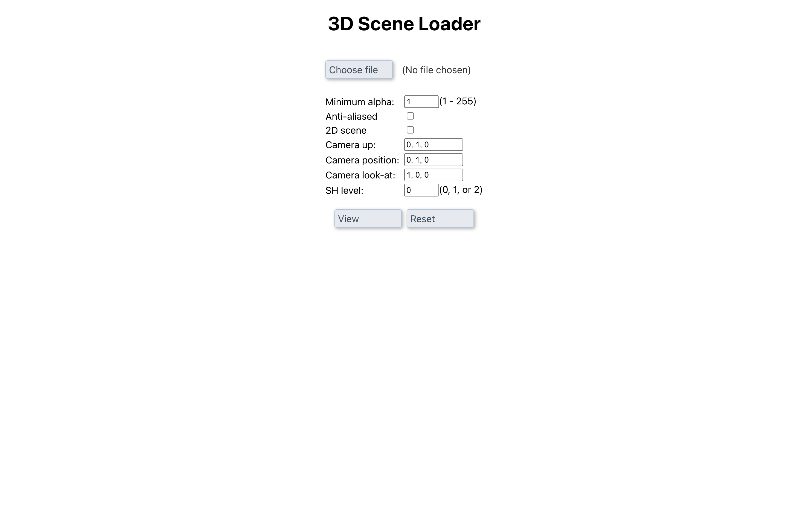

# Gaussian Splat Rendering Web Demo

This project is a web-based demo for rendering Gaussian splat files using Three.js in React. The project is based on the [GaussianSplats3D repository](https://github.com/mkkellogg/GaussianSplats3D).

## Features

- Renders `.splat`, `.ksplat`, and `.ply` files
- Simple interface for rendering 3D point clouds
- Provides sample demo files for users to download and try out
- Fully responsive interface

## Controls

Here are the key controls you can use in the demo:

- **C**: Display debug info panel
- **U**: Toggle mesh cursor
- **←**: Rotate camera-up counter-clockwise
- **→**: Rotate camera-up clockwise
- **P**: Toggle point-cloud mode
- **O**: Toggle orthographic mode
- **=**: Increase splat scale
- **-**: Decrease splat scale

## Getting Started

To get a local copy of the project up and running, follow these steps:

### Prerequisites

Ensure you have Node.js and npm installed.

### Installation

1. Clone the repository:

   ```bash
   git clone https://github.com/your-username/gaussian-splat-demo.git
   cd gaussian-splat-demo
   ```

2. Install dependencies:

  ```bash
  npm install
  ```

3. Start the development serve

  ```bash
  npm start
  ```

### Viewing the Demo

Once the server is running, you can open `http://localhost:3000` in your browser to view the web interface.

### Interface Preview

#### User Interface



#### Rendered Scene


## Download Sample Demo Files

You can download sample `.splat`, `.ksplat`, or `.ply` files to use in the demo. Click the links below to download:

The demo scene data is available here: <https://projects.markkellogg.org/downloads/gaussian_splat_data.zip>

## Uploading Your Files

To upload and render your own `.splat`, `.ksplat`, or `.ply` files, simply drag and drop the file into the interface, or click the "Upload" button and select your file.